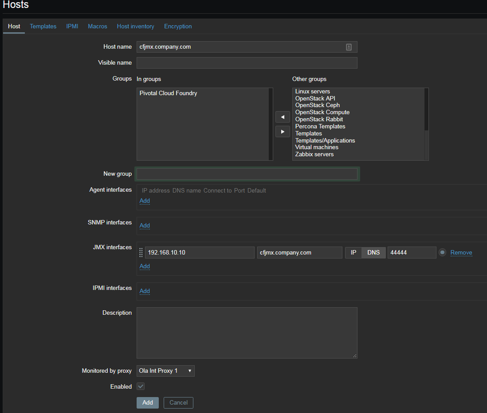
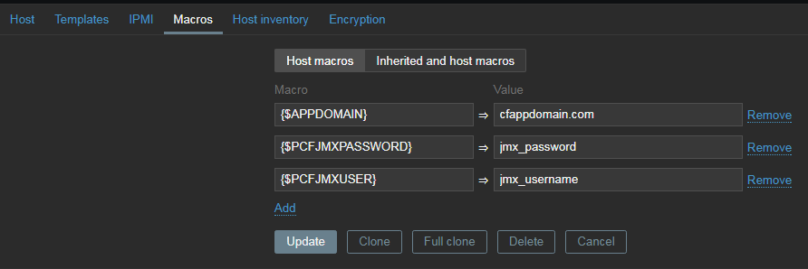
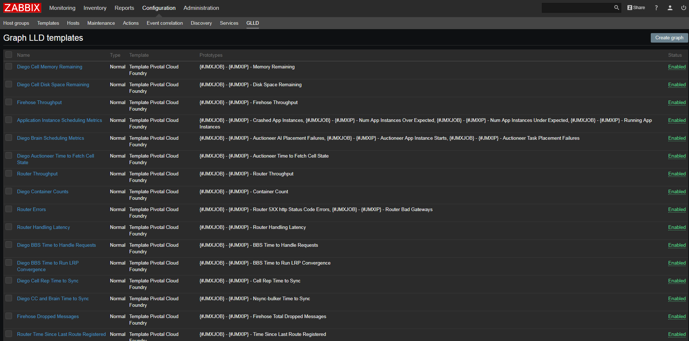

Pivotal Cloud Foundry Monitoring (1.10) for Zabbix (3.4+)
=============

## Description
This template uses Zabbix LLD to monitor Pivotal Cloud Foundry with Zabbix.
https://github.com/bmhkb4/zabbix-pcf-monitoring

## Features
1. Dynamic VM Component Monitoring
Collect VM health metrics and alert on VM down

2. Dynamic Firehose Nozzle Metric Monitoring
Collect and alert on PCF [Key Performance Indicators](https://docs.pivotal.io/pivotalcf/1-10/monitoring/kpi.html)

3. Monitor Application Manager
Monitor apps.pcfappdomain.com status

## Installation
1. [Install](https://docs.pivotal.io/jmx-bridge/1-9/installing.html) the [JMX Bridge](https://network.pivotal.io/products/p-metrics) in your Pivotal Cloud Foundry foundation.  
Enable the [Nozzle Prefix](https://docs.pivotal.io/jmx-bridge/1-9/installing.html#config-prefix) (or don't and update the discovery items to remove the prefix).

2. Add the Cloud Foundry JMX Endpoint to Zabbix

3. Enter the value in your environment at template user macros.

4. Upload the template to Zabbix 3.4+

5. Update the template Macros to fit your PCF environment

6. (Optional) Add dynamic graphs
[Graph LLD Items](https://github.com/sepich/glld)

## License
[Apache License, Version 2.0](http://www.apache.org/licenses/LICENSE-2.0)

## Author
[bmhkb4](https://github.com/bmhkb4)
